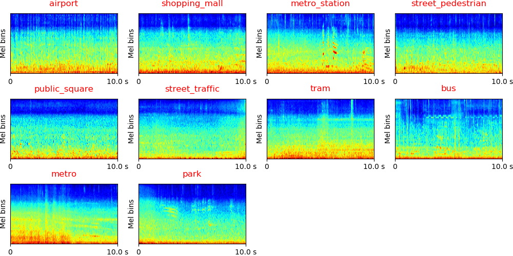
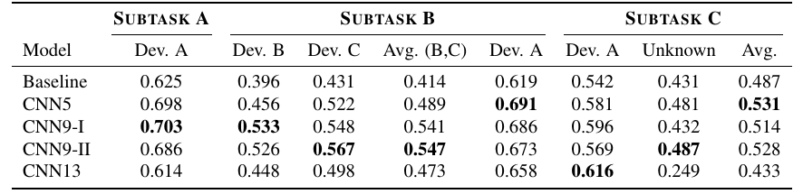
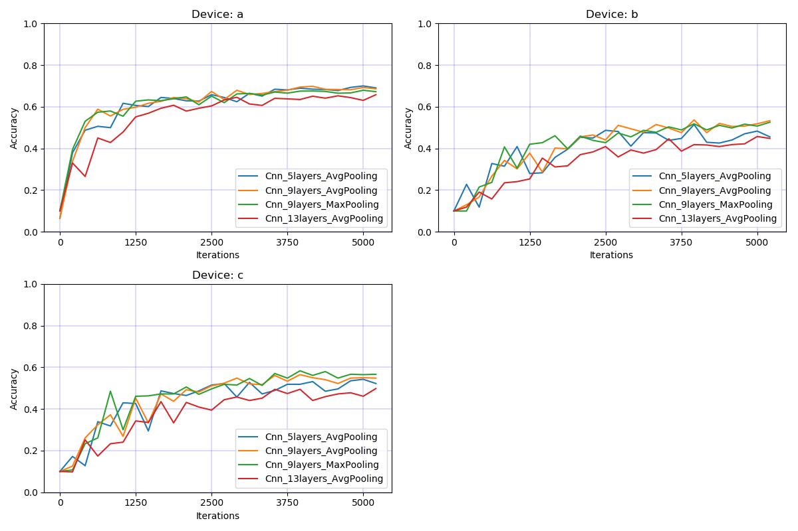
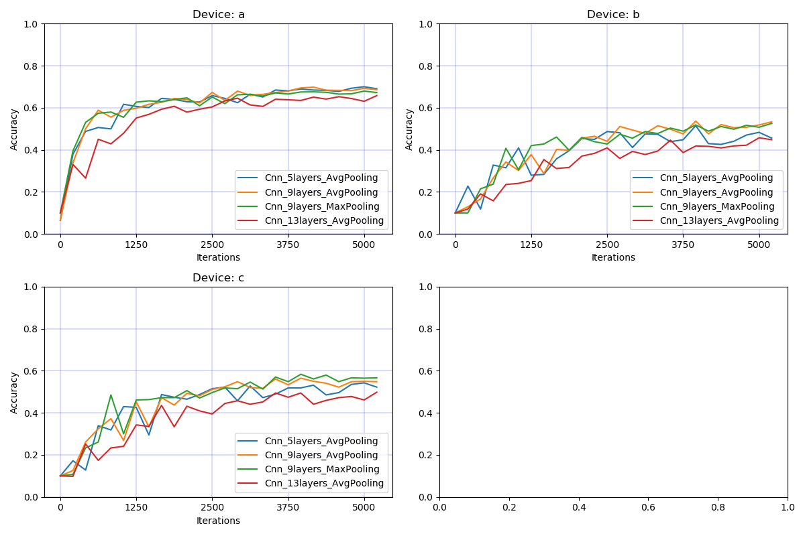
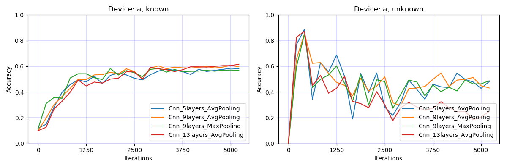

# DCASE2019 Task1 Acoustic scene classification

DCASE2019 Task1 Acoustic scene classification (ASC) is a task to classify a test recording into one of the provided predefined classes that characterizes the environment in which it was recorded. There are three subtasks in DCASE2019 Task1:

Subtask A: Matching device ASC, where the recordings from the same device are used for training and testing. 

Subtask B: Mis-matching device ASC, where different devices are used for training and testing. 

Subtask C: Open-set ASC, where testing data contains classes outside the predefined classes. 

More description of this task can be found in http://dcase.community/challenge2019/task-acoustic-scene-classification

## Dataset
The dataset can be downloaded from http://dcase.community/challenge2019/task-acoustic-scene-classification. The recordings are recorded from different locations from 12 European cities. There are 10 acoustic scenes such as 'Airport' and 'Urban park'. The recordings are recorded with different devices. Each audio recording is 10-second in length. The statistic of the data is shown below:

|           |                        Dev. (Train)                       |                      Dev. (Validate)                     | Evaluation |
|:---------:|:---------------------------------------------------------:|:--------------------------------------------------------:|:----------:|
| Subtask A |                            9185                           |                           4185                           |      -     |
| Subtask B | 10265 = 9185 (Device A) + 540 (Device B) + 540 (Device C) | 5265 = 4185 (Device A) + 540 (Device B) + 540 (Device C) |      -     |
| Subtask C |         10290 = 9185 (in domain) + 1105 (unknown)         |          4530 = 4185 (in domain) + 345 (unknown)         |      -     |

The log mel spectrogram of different acoustic scenes should looks like:

## Run the code

**0. Prepare data** 

Download and upzip data, the data looks like:

<pre>
dataset_root
├── TAU-urban-acoustic-scenes-2019-development (Subtask A)
│    ├── audio (14400 files)
│    |    ├── street_pedestrian-london-263-7978-a.wav
│    |    └── ...
│    ├── evaluation_setup
│    |    ├── fold1_train.csv
│    |    ├── fold1_evaluate.csv
│    |    └── fold1_test.csv
│    ├── meta.csv
│    └── ...
├── TAU-urban-acoustic-scenes-2019-mobile-development (Subtask B)
│    ├── audio (16560 files)
│    |    ├── street_pedestrian-london-263-7978-a.wav
│    |    └── ...
│    ├── evaluation_setup
│    |    ├── fold1_train.csv
│    |    ├── fold1_evaluate.csv
│    |    └── fold1_test.csv
│    ├── meta.csv
│    └── ...
└── TAU-urban-acoustic-scenes-2019-openset-development (Subtask C)
     ├── audio (15850 files)
     |    ├── street_pedestrian-london-263-7978-a.wav
     |    └── ...
     ├── evaluation_setup
     |    ├── fold1_train.csv
     |    ├── fold1_evaluate.csv
     |    └── fold1_test.csv
     ├── meta.csv
     └── ...
</pre>

**1. Requirements** 

python 3.6 + pytorch 1.0

**2. Then simply run:**

$ Run the bash script ./runme.sh

Or run the commands in runme.sh line by line. The commands includes:

(1) Modify the paths of dataset and your workspace

(2) Extract features

(3) Train model

(4) Inference

## Model
We apply convolutional neural networks using the log mel spectrogram of audio recording as input. For subtask A and subtask B, the output is one of 10 classes. For subtask C, the output is one of 11 classes which includes the unknown class. 

## Results
To train a CNN with 9 layers and a mini-batch size of 32, the training takes approximately 200 ms / iteration on a single card GTX Titan Xp GPU. The model is trained for 5000 iterations. The training looks like:

<pre>
Load data time: 15.414 s
Training audio num: 9185
Validation audio num: 4185
------------------------------------
...
------------------------------------
Iteration: 5000
Data type: train
    Source: a
    Accuracy: 0.996
Data type: validate
    Source: a
    Accuracy: 0.693
    Dump statistics to /vol/vssp/msos/qk/workspaces/dcase2019_task1/statistics/main/logmel_64frames_64melbins/Cnn_9layers_AvgPooling/TAU-urban-acoustic-scen
es-2019-development/validate_statistics.pickle
Train time: 40.492 s, validate time: 25.221 s
Model saved to /vol/vssp/msos/qk/workspaces/dcase2019_task1/checkpoints/main/logmel_64frames_64melbins/Cnn_9layers_AvgPooling/TAU-urban-acoustic-scenes-201$
-development/5000_iterations.pth
------------------------------------
...
</pre>

**Classification result**

The table below shows the development performance of different models. The official baseline system result is from [2]. CNN5, CNN9-I, and CNN13 are 5-layer, 9-layer and 13-layer CNNs applies 2x2 average pooling. CNN9-II applies 2x2 max pooling. The table shows that CNN9 achieves a good result in Subtask A and B. 

**Subtask A**

**Subtask B**

**Subtask C**

## Summary
This codebase provides a convolutional neural network (CNN) for DCASE 2019 challenge Task 1 Acoustic scene classification. 

## Citation

**If this codebase is helpful, please feel free to cite the following paper:**

**[1] Qiuqiang Kong, Yin Cao, Turab Iqbal, Yong Xu, Wenwu Wang, Mark D. Plumbley. Cross-task learning for audio tagging, sound event detection and spatial localization: DCASE 2019 baseline systems. arXiv preprint arXiv:1904.03476 (2019).**

## FAQ
If you met running out of GPU memory error, then try to reduce batch_size. 

## External link & references
[2] https://github.com/toni-heittola/dcase2019_task1_baseline

[3] Annamaria Mesaros, Toni Heittola, and Tuomas Virtanen. A multi-device dataset for urban acoustic scene classification. In Proceedings of the Detection and Classification of Acoustic Scenes and Events 2018 Workshop (DCASE2018), 9–13. November 2018. URL: https://arxiv.org/abs/1807.09840.
